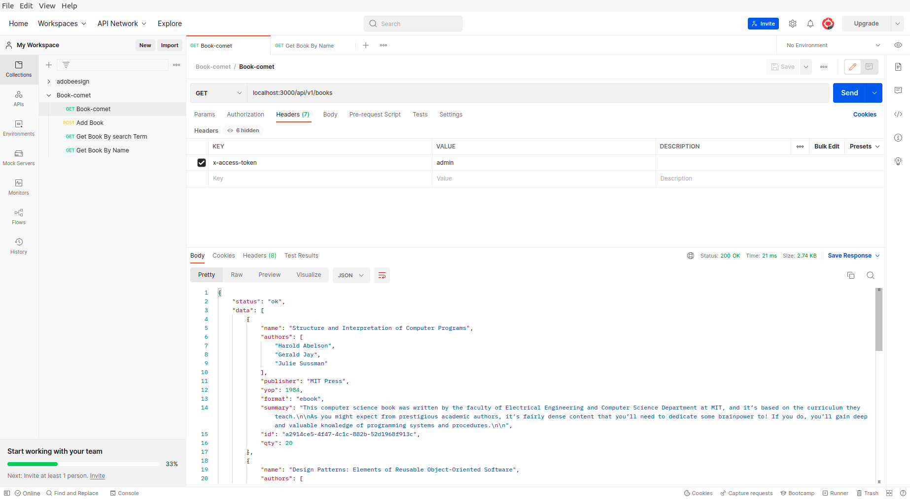

# Book Comet
Book Comet:This project contains backend API made on Nodejs and we have used JSON file instead database and nodejs fs module to read and write from database.

We have also created [frontend application](https://github.com/ritik-ongraph/book-comet-frontend.git) for it on Angular and it can be clone from [here](https://github.com/ritik-ongraph/book-comet-frontend.git)


## Recomended Node Version
```
node v16.15.1
```


## Run Locally

Clone the project

```bash
  git clone https://github.com/ritik-ongraph/book-comet-api
```

Go to the project directory

```bash
  cd book-comet-api
```

Install dependencies

```bash
  npm install
```

Start the server

```bash
  node app.js
```
you can also use nodemon
```bash
  npm start
```

By default it will run on PORT 3000

## API Reference

##  Authentication

We have implement fake authentication for api so If you want to access api you have to pass x-access-token in request headers
| Headers                 | Value      | Description                       |
| :-----------------------| :----------| :-------------------------------- |
| `[x-access-token]`      | `admin`    | **Required**                      |

In our [angular application](https://github.com/ritik-ongraph/book-comet-frontend.git) we are setting token to locaal storage when user login and the through interceptor we are appending it to request headers



#### Get all items

```http

  GET /api/v1/books

```

It returns all the books


#### Get Book By Book Name and Book Id

```http

GET /api/v1/books/id/{id}/name/{name}

```
| Parameter | Type     | Description                       |
| :-------- | :------- | :-------------------------------- |
| `id`      | `string` | **Required**. Id of item to fetch |
| `name`    | `string` |  **Required**. Name of item to fetch

### Get Book by Author and Publisher
```http

GET /api/v1/books/id/{id}/name/{name}

```
| Parameter   | Type     | Description                                 |
| :--------   | :------- | :--------------------------------           |
| `author`    | `string` | **Required**. author of item to fetch       |
| `publisher` | `string` |  **Required**. publisher of item to fetch   | 


### Get Book By Searchterm

```http

GET /api/v1/books/searchterm/

```

| Query String Parameter   | Type     | Description                                 |
| :------------------------| :------- | :--------------------------------           |
|`id`                      | `string` | **optional**. ID of item to fetch           |
| `name`                   | `string` | **optional**  Name of item to fetch         |
| `author`                 | `string` | **optional**. author of item to fetch       |
| `publisher`              | `string` |  **optional**. publisher of item to fetch   | 


### Get Book By Id

```http

GET /api/v1/books/{id}

```


| Parameter   | Type     | Description                                 |
| :--------   | :------- | :--------------------------------           |
|`id`         | `string` | **Required**. ID of item to fetch           |


### POST Add New Book

```http

POST /api/v1/books

```


|  Parameter    |         Type            | Description                                                               |
| :-------------| :-----------------------| :--------------------------------                                        |
|`name`         | `string`                | **Required**. Name of the book                                           |
|`authors`      | `Array<string>`         |  **Required**. Authors of the book                                       |
|`publisher`    | `string`                | **Required**. publisher of the book                                      |
|`yop`          | `integer`               |  **Required**. year of  publication the book                             |
|`format`       | `string enum`           | **Required**. format of the book  'ebook', 'epub', 'paperback'           |
|`qty`          | `integer`               | **Required**. qunatity of the book                                       |
|`summary`      | `string`                |  **Required**. summary of the book                                       |


### PUT Update All field of Book

```http

PUT /api/v1/books/{id}

```


|  Parameter    |         Type            | Description                                                               |
| :-------------| :-----------------------| :--------------------------------                                        |
|`name`         | `string`                | **Required**. Name of the book                                           |
|`authors`      | `Array<string>`         |  **Required**. Authors of the book                                       |
|`publisher`    | `string`                | **Required**. publisher of the book                                      |
|`yop`          | `integer`               |  **Required**. year of  publication the book                             |
|`format`       | `string enum`           | **Required**. format of the book  'ebook', 'epub', 'paperback'           |
|`qty`          | `integer`               | **Required**. qunatity of the book                                       |
|`summary`      | `string`                |  **Required**. summary of the book                                       |


### Patch Update field of Book

```http

PATCH /api/v1/books/{id}

```


|  Parameter    |         Type            | Description                                                               |
| :-------------| :---------------------- | :--------------------------------                                        |
|`name`         | `string`                | **optional**. Name of the book                                           |
|`authors`      | `Array<string>`         |  **optional**. Authors of the book                                       |
|`publisher`    | `string`                | **optional**. publisher of the book                                      |
|`yop`          | `integer`               |  **optional**. year of  publication the book                             |
|`format`       | `string enum`           | **optional**. format of the book  'ebook', 'epub', 'paperback'           |
|`qty`          | `integer`               | **optional**. qunatity of the book                                       |
|`summary`      | `string`                |  **optional**. summary of the book                                       |


### DELETE  All field of Book

```http

DELETE  /api/v1/books/{id}

```
### Note : -
you can not delete book that has positive inventory.
Book qty should be set to zero before deleting a book


## Inventory API


### Patch Update Quantity of Book

```http
PATCH /api/v1/books/inventory/bookid/{id}
```


|  Parameter    |         Type            | Description                                  |
| :-------------| :-----------------------| :--------------------------------            |                      
|`BookId`       | `string`                | **optional**. ID of the book                 |
|`qty`          | `integer`               |  **Required**. qunatity of the book          |


```http
PATCH /api/v1/books/inventory/{id}
```


|  Parameter    |         Type            | Description                                  |
| :------------ | :-----------------------| :--------------------------------            |                                           
|`qty`          | `integer`               |  **Required**. qunatity of the book          |

### Note: -

you can not set negative book inventory 


```http
 Delete /api/v1/books/inventory/{id}
```
|  Query Parameter    |         Type                    | Description                                  |
| :------------------ | :-----------------------------  | :--------------------------------            |                                           
|`id`                 | `integer`                       |  **Required**. Inventory Id  book            |


